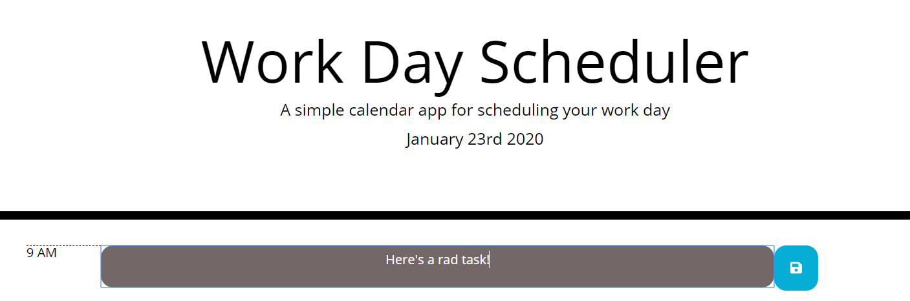
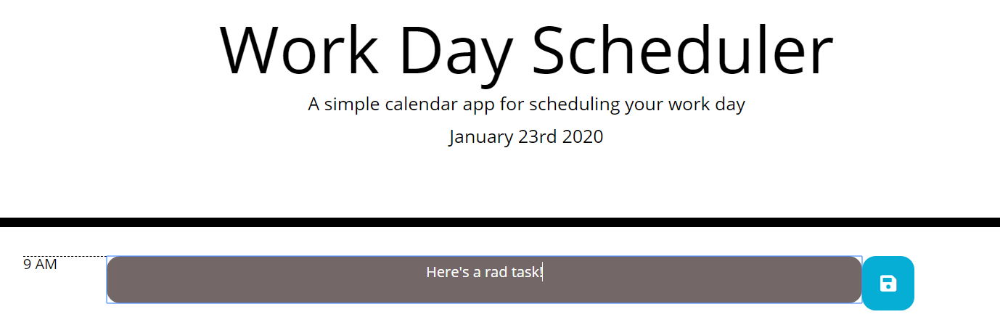

# work_day_scheduler

Is your desk covered in loose paper and sticky-notes? Is your boss always hounding you because you forgot about the big project you were supposed to have completed by Monday?

Look no further! This is a "state-of-the-art" task scheduler. The current hour is highlighted in a beautiful lavender. You are able to put in any task and save it for the day. 

Test it out and show your boss how organized you are!

## Languages
This application is made with HTML, CSS, and Javascript. 

## Reference Libraries:
* Font Awesome
* Bootstrap
* jQuery
* Moment.js

## Instructions
1. Type your task into the colored text area

2. Click on the save button when you are done writing your task

3. Your submitted tasks will be there even if you refresh the browser. Go ahead! Try it!

## Authors

* **Emily Taylor** - *Initial work* - [emilyporterfieldtaylor](https://github.com/emilyporterfieldtaylor)

## License

This project is licensed under the MIT License 

## Acknowledgments

* Tyler Wood - my helpful roommate